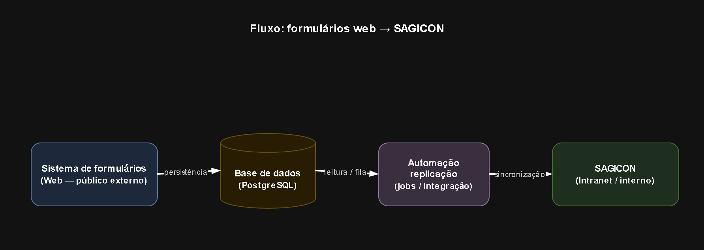

# Proposta técnica — Plataforma de formulários eletrônicos online (versão pós-alinhamento)

**Referência:** Pesquisa de Mercado nº 001/2026/CRF-MT — Levantamento para desenvolvimento de plataforma de formulários eletrônicos online do CRF-MT.

**Proponente:** Z F WEB TECH LTDA  
**CNPJ:** 63.119.849/0001-07  
**Local:** Brasília — DF  
**Contato (proponente):** contato.zfwebtech@gmail.com  

**Destinatário:** Conselho Regional de Farmácia do Estado de Mato Grosso — CRF-MT  
**Contato (conforme documento de pesquisa):** alex@crfmt.org.br  

**Data:** 02 de junho de 2026  

**Nota de versão:** Este documento **consolida as definições** já presentes na proposta preliminar (`resposta-crf-mt.md`) e incorpora **esclarecimentos obtidos em conversa com o Alex** quanto ao problema a ser resolvido, ao modelo de acesso e à solução de integração com o sistema **SAGICON**. As **definições técnicas de stack e arquitetura** permanecem **inalteradas** em relação ao documento preliminar.

---

## 1. Definições já estabelecidas (mantidas do documento preliminar)

### 1.1 Solução técnica em linhas gerais

- **Aplicação web monolítica** centrada em **formulários dinâmicos**, perfis de atendimento (**Pessoa Física** e **Pessoa Jurídica**), **validações** e **regras de negócio** por serviço.  
- **Preenchimento responsivo** (desktop e mobile), **auditoria** e **conformidade com a LGPD**.  
- **Geração automática de PDF** no padrão institucional do CRF-MT e **exportação de dados** para fins gerenciais e administrativos.  
- **Frontend em React.js**, **backend em .NET (ASP.NET Core)** e **banco de dados PostgreSQL**.  
- Hospedagem em **ambiente a definir** conforme volume de usuários, disponibilidade e política de segurança do CRF-MT (detalhes operacionais de hospedagem seguem como variável — ver seção 4).

### 1.2 Arquitetura recomendada (inalterada)

| Camada | Tecnologia | Observação |
|--------|------------|------------|
| Interface | **React.js** | SPA ou SSR conforme decisão de SEO/integração com portal; componentes reutilizáveis para campos comuns entre formulários. |
| API e regras de negócio | **.NET** (ASP.NET Core) | Monólito modular: um deploy, módulos internos por domínio (cadastro, formulários, PDF, relatórios, administração). |
| Persistência | **PostgreSQL** | Dados transacionais, metadados de formulários, trilhas de auditoria e exportações. |
| Geração de PDF | Serviço no mesmo monólito ou biblioteca integrada | Templates alinhados aos PDFs atuais; versionamento de modelos. |

**Justificativa da arquitetura monolítica:** o escopo é predominantemente **formulários, validações, PDF e integrações pontuais**, sem necessidade imediata de microsserviços; isso **reduz complexidade operacional**, custo de infraestrutura e tempo de implantação, mantendo possibilidade de **evolução futura** (extração de módulos ou APIs dedicadas) se o volume ou a governança do CRF-MT exigirem.

### 1.3 Tecnologia para o desenvolvimento (inalterada)

- **Frontend:** React.js (TypeScript recomendado para robustez e manutenção).  
- **Backend:** .NET (ASP.NET Core), APIs REST, autenticação integrada ao monólito conforme decisão de modelo de identidade (ver seção 2).  
- **Banco:** PostgreSQL.  
- **Integração com portal WordPress:** consumo de APIs do sistema de formulários (links “preencher online” no WordPress redirecionando ou incorporando iframe/SSO, conforme política de segurança) ou publicação de endpoints estáveis documentados (OpenAPI).  
- **Integrações externas:** exposição e consumo de APIs (HTTP/JSON), filas ou jobs internos para processamentos assíncronos (ex.: geração de PDF em lote, **replicação automatizada para sistemas legados**), conforme necessidade levantada em fase de requisitos.

### 1.4 Funcionalidades alinhadas ao documento de pesquisa (inalteradas)

- Seleção de perfil (**PF/PJ**) e **catálogo dinâmico de serviços** por perfil.  
- Formulários **responsivos**, validação de **campos obrigatórios** e **regras específicas** (horários, cargas horárias, consistências, alertas).  
- **Preenchimento assistido** com dados permitidos pelo CRF-MT, com registro de consentimento e minimização de dados (LGPD).  
- **Geração automática de PDF** final compatível com o fluxo administrativo atual.  
- **Exportação** para gestão (relatórios, CSV/Excel conforme política do órgão).  
- **Alertas e críticas** automáticas para inconsistências.  
- **Rastreabilidade e auditoria** (quem, quando, o quê, IP quando aplicável, versão do formulário).  
- Módulo de **administração** para versionamento de formulários, parâmetros e configurações operacionais do conselho.

### 1.5 Requisitos mínimos de infraestrutura e banco (orientativos — premissas gerais mantidas)

- **Aplicação:** serviço web (.NET) + armazenamento para PDFs e anexos (se houver).  
- **Banco:** PostgreSQL com backup, réplica ou ambiente de homologação conforme criticidade.  
- **Ambientes:** pelo menos **desenvolvimento**, **homologação** e **produção**; quantidade de réplicas em produção escala com carga.  
- Dimensionamento fino de CPU/RAM, custos de cloud e topologia exata **dependem** de métrica de concorrência, política de retenção e decisão de hospedagem (seção 4).

### 1.6 Equipe técnica sugerida (inalterada)

- Product Owner / Analista de negócio (interface com áreas do CRF-MT).  
- Arquiteto/desenvolvedor backend .NET.  
- Desenvolvedor frontend React.js.  
- Especialista em UX/UI (formulários longos e acessibilidade).  
- QA / testes.  
- DevOps ou responsável por deploy e ambientes (conforme hospedagem definida).  

Escalação opcional: DPO consultivo ou parecer jurídico-interno do CRF-MT para fluxos de dados sensíveis.

### 1.7 Riscos e recomendações (inalterados em essência)

- **Complexidade subestimada** em formulários com muitas regras: mitigação com **priorização por ondas** e prova de conceito em formulários críticos.  
- **Alinhamento PDF final** com identidade visual e campos legais: validação jurídica/administrativa do CRF-MT.  
- **LGPD:** bases legais, política de retenção, direitos do titular e registro de operações de tratamento.  
- **Integração com SAGICON:** dependência de conhecimento técnico do sistema alvo, disponibilidade de interfaces ou rotinas aceitas pelo fornecedor/CRF-MT — ver seção 4.

---

## 2. Lacunas sanadas após contato — autenticação e autorização

As questões da **seção 10** do documento preliminar (usuários cadastrados vs. anônimos, restrição por perfil, granularidade de acesso, gestão de identidade) passam a ter **premissa alinhada com o CRF-MT (via Alex)** da seguinte forma:

### 2.1 Autenticação (público externo)

- **Haverá autenticação** para o **público externo**, implementada por **SSO / OAuth** (provedor institucional ou de mercado, conforme decisão do CRF-MT) **ou** modelo **autenticação proprietária** (cadastro/login gerido na própria aplicação ou no ecossistema definido pelo conselho).  
- A escolha exata (qual IdP, Gov.br, Azure AD, login próprio, etc.) será **formalizada em fase de requisitos** sem alterar a stack técnica (.NET/React/PostgreSQL).

### 2.2 Autorização

- **Não haverá gestão de autorização** no sentido de perfis diferenciados de cidadão: o uso é voltado ao **usuário público** — **qualquer pessoa na internet** pode utilizar os fluxos disponibilizados pelo conselho, **após** cumprir o mecanismo de autenticação acordado (ou seja, autentica para identificar sessão e auditoria/LGPD, **sem** camada adicional de “papéis” tipo RT vs. farmacêutico vs. interno nesta aplicação de formulários públicos).  
- Áreas **estritamente administrativas** do conselho (configuração de formulários, exportações sensíveis, etc.), se existirem neste mesmo deploy, seguem o padrão usual de **módulo admin** com credenciais institucionais — detalhar em escopo sem conflitar com o princípio de “público externo sem RBAC de cidadão”.

### 2.3 Definições técnicas (stack, monólito, PDF, LGPD)

- **Permanecem inalteradas** conforme seções 1.1 a 1.4 e 1.7 deste documento.

---

## 3. Proposta de solução para atendimento ao problema (pós-alinhamento)

### 3.1 Aplicação web pública

- **Aplicação web pública** destinada ao **público externo**, na qual serão disponibilizados:  
  - **Envio de formulários diversos** para demandas que o **CRF-MT** considerar necessárias (catálogo configurável pelo conselho).

### 3.2 Fluxo de dados e integração com SAGICON

**Preview do fluxo de dados** (imagem estática — visível na visualização do Markdown no GitHub):

**Visualização do fluxo dos dados dos formulários** (diagrama interativo no [diagrams.net](https://www.diagrams.net/) — viewer em lightbox): [abrir fluxo: Web → base de dados → automação → SAGICON](https://viewer.diagrams.net/?tags=%7B%7D&lightbox=1&highlight=0000ff&edit=_blank&layers=1&nav=1&title=fluxo-formulario-sagicon.drawio&dark=auto#R%3Cmxfile%3E%3Cdiagram%20id%3D%22fluxo-form-sagicon%22%20name%3D%22Fluxo%20CRF-MT%22%3E1Vhdk9o2FP01nmkfNmNb2MCjYT%2BSmW2zHTqT9FG2LkZZYVFZXqC%2Fvle2jL9oIRtIsvvA6l5JV9I950gXHDJf7x4U3ax%2BkwyE47ts55Bbx%2Fe9kTfCf8azrzzjwKscqeLMDmocC%2F4PWKdrvQVnkHcGaimF5puuM5FZBonu%2BKhSctsdtpSiu%2BqGpjBwLBIqht5PnOmV9XrhtOl4Dzxd2aUn%2FrjqWNN6sD1JvqJMblsucueQuZJSV631bg7CJK%2FOSzXv%2Fj96DxtTkOlzJmiu8VCDSTZOrvf1kTXssG%2B20muBDg%2BbuVbyGeZSSIWeTGY4crbkQvRcVPA0QzPB6ID%2B2QsozTGZke1Yc8ZEOVlm2oKNDCGzahMvVBR2E44fCrOLGBupadyLYicdEpUgqnUhnDlxIk9xmaNrCzjQde58ZxI6UxNrET18mH%2F8vY6DeTmEsovh3mDXSoJN2wPINWi1xyGrFrDEwrhtWDByrc9GIVNrW67XJrUcTA%2BRG5iwYZE6jlosdzfl4U7jpmSRMWAWs%2B2Ka1hsaGJ6tyjOLqRt9ByfMAqTZTKAGnvCZALxsobMruYN8FrwXMOaGqXDUYgsnKoBofKYsJ1zhH8Xsu64yUuORJ632TU9dYhfPjWou850ZDJklpxFseCJRBOZDCqTv7ZYUK33DUSYDInghV0ieD0i%2BMGFmMDOIgLeNBvTTPaCIyMUOU2HuOLOY3xw0OQ5LRn1sdAYBuqrwIrWH3JouVz6yVEOsTAOg%2FAkh2Y0h5pADC%2FLK7HmSeY6VbD44%2FGivJgGQ174XV6MSI8XZHIZXtBCy2tfEeCxAMbH4J2GY0JPwxvhJvGGMHfCuPwkcgiwgg1q99SoS9Dgi4zNy2HyjMnEBytV3WWvfmuMuuwI%2B%2By41K2R0%2FTq70cAEzY6Ro6JH5PwNDl6z%2FVlof6QaUUz0B24f8C7MAmugDDYZAIbVLJDtGWhEjhSWbRoABmLTOGMVixk8vznimfHysG6HDYvAc6556Luhx3Xn1vtv7DtvgusdWuS4dbGvjYQov3nttGaZcxmWml15j2B4pg3U3KWzupMmqoUdP%2FxHIKoQFDNX7rJ%2BzZEhNP%2BUkLjOrfuEBkYCtEg%2BUhj%2FCbVSfv51bUC1INd1eRjI5Hw5YGCmRPc9upv19ot0VZ%2FA5FuQOVY55X3Y5QlnJ4tlKM5tlNu3HdeRxb%2FA4GN%2FGQO1Boil8vcyLuH0WED58Hmv15I7KfRERp9ObxWW8dlVNca30NI%2FtcIyX87QhLAdaHo4T3C1%2FRiWnKDn0JM5PViaqrZHy%2Bni0rHFmLfQznka5RD3o5ycp4lSmYYu%2FcV4Q2LB83mZ8BqePNjKrn7Fw%3D%3D%3C%2Fdiagram%3E%3C%2Fmxfile%3E).

1. **Cadastro/envio do formulário** pelo usuário autenticado (conforme item 2.1).  
2. **Armazenamento** das informações em **banco de dados** (PostgreSQL), com auditoria e regras de negócio já descritas.  
3. **Replicação automatizada** dos dados para o sistema **SAGICON**, por **automação** (jobs, integração via API, importação programada ou outro mecanismo **a definir** com base na documentação e possibilidades técnicas do SAGICON).  
4. Após a replicação bem-sucedida, os dados passam a estar **disponíveis no SAGICON** com **protocolo de pré-cadastro**, conforme fluxo operacional esperado pelo conselho.

### 3.3 Efeito esperado na operação do CRF-MT

- **Redução da dinâmica operacional interna**, **agilização** e **modernização** do atendimento do conselho, ao digitalizar a captação de demandas e alimentar o SAGICON sem retrabalho manual equivalente ao cenário atual.

---

## 4. Itens ainda sujeitos a ajuste (prazo e valor)

Por **falta de detalhes definitivos** sobre:

- **Hospedagem** (volume, SLA, soberania, cloud vs. ambiente institucional); e  
- **Conhecimento aprofundado do sistema SAGICON** (interfaces oficiais, contratos de dados, ambiente de homologação, responsável técnico no fornecedor),

a proposta **pode evoluir para mais ou para menos** em **escopo, prazo e valor**, após levantamento técnico formal e prova de integração.

---

## 5. Estimativas preliminares atualizadas (faixa orientativa)

| Item | Conteúdo |
|------|-----------|
| **Prazo estimado** | **90 a 120 dias** (condicionado ao fechamento de requisitos da 1ª onda de formulários, complexidade das regras e viabilidade técnica da ponte com SAGICON). |
| **Valor estimado — implantação** | **R$ 70.000 a R$ 90.000** (faixa indicativa; pode ser refinada após definição de hospedagem e desenho da integração com SAGICON). |
| **Suporte e manutenção** | Contrato mensal ou horas técnicas, proporcional a SLA e evoluções — **estimativa após** definição de escopo operacional pós-implantação. |

---

## 6. Síntese atualizada

| Campo | Conteúdo |
|--------|----------|
| **Solução proposta** | Aplicação web pública de formulários dinâmicos; armazenamento em PostgreSQL; automação de replicação para **SAGICON** com protocolo de pré-cadastro; PDF institucional, auditoria e LGPD; stack React.js + .NET + PostgreSQL. |
| **Autenticação** | SSO/OAuth ou autenticação proprietária para público externo. |
| **Autorização (público)** | Sem gestão de autorização por perfis de cidadão; acesso amplo à internet após autenticação. |
| **Tecnologia recomendada** | React.js + .NET (ASP.NET Core) + PostgreSQL (inalterado). |
| **Principais premissas** | Escopo por ondas de formulários; confirmação técnica com SAGICON; hospedagem e volumes; integração WordPress/links conforme política do conselho. |

---

## 7. Experiências anteriores

- GitHub: [https://github.com/aasf86](https://github.com/aasf86)  
- LinkedIn:   
- WhatsApp (falar com o desenvolvedor — API oficial):  — número **+55 65 99217-7335**

---

**Declaração:** Esta manifestação destina-se ao **levantamento de mercado e planejamento** do CRF-MT, com **faixas de prazo e valor** dadas de forma orientativa após alinhamento preliminar; não substitui proposta comercial vinculante sem contrato e especificação detalhada.

**Z F WEB TECH LTDA**

CNPJ 63.119.849/0001-07  

Brasília/DF  

contato.zfwebtech@gmail.com 

WhatsApp (falar com o desenvolvedor — API oficial):  — número **+55 65 99217-7335**